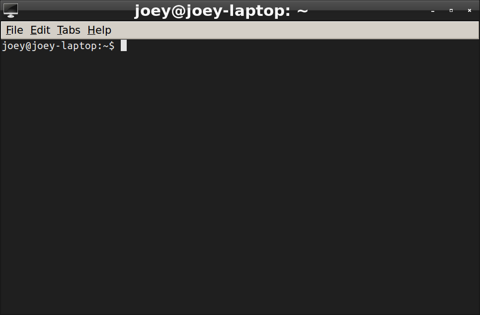

# LXDE to OS X 



## about

this is a maximum productivity module, it makes LXDE work and feel more like OS X. best when used with a MacBook keyboard and touchpad

### table of contents

i. [lxde-rc.xml](#lxde-rc.xml)

ii. [autostart](#autostart)

iii. [install](#install)

iv. [deploy](#deploy-new-version-to-git)

v. [additional](#additional-stuff)

## sections

### lxde-rc.xml

lxde-rc.xml is the openbox configuration i use

a lot of it tries to replicate common keystrokes from OS X 

a big addition here is the **wmctrl-switch-by-application**, which lets you switch by application using super+\` which mimics OS X behavior.

i switch my desktop using super+1, super+2, super+n... etc so that's there

also, the shutter program allows you to take screenshots like OS X

super+shift+4 is a selection screenshot

super+shift+5 is an EMACS-like keybind,

super+shift+5 -> space = window screenshot

super+shift+5 -> 5 = full-screen screenshot

some other basic stuff, like super+q quits programs is included

note: looks like `gnome-screensaver-command -l` doesn't work any more, i've replaced it with lxlock

### autostart

my autostart controls some low-level mouse and keyboard stuff,

#### mouse

the touchpad settings i use are DetectPalm=1 and also i disable the touchpad while typing for 1 second (might lower this in the future 1 second is literally forever)

#### keyboard

i take away the capslock lock and replace that keybind with escape for vim and navigation purposes. it's great

this is achieved through .caps_esc which runs at login


## install

there are some prereqs,

### prerequisites

[wmctrl][0]

```
apt-get install wmctrl
```

[shutter][1]

```
apt-get install shutter
```

### installation 

now, clone this repo to ~/.config/joey

link up wmctrl-switch-by-application:

```
ln -s wmctrl-switch-by-application /usr/bin/wmctrl-switch-by-application 
```

**NOTE:** on some systems, `ln` should point to the full path of `wmctrl-switch-by-application`. 

place autostart in its correct path:

```
cp autostart ~/.config/lxsession/LXDE/autostart
```

place lxde-rc.xml in its correct path:

```
cp lxde-rc.xml ~/.config/openbox/lxde-rc.xml
```

you should back those files up first before copying them over tbh

reconfigure openbox

```
openbox --reconfigure
```

## deploy new version to git

if we made changes to the live configuration files, they need to be added to this directory first:

copy `~/.config/openbox/lxde-rc.xml` to this directory

copy `~/.config/lxsession/LXDE/autostart` to this directory

```
git push
```

## additional stuff

gvim

```
apt-get install vim-gnome
```

synapse

```
apt-get install synapse
```

**for Ubuntu 14.04**:
```
sudo add-apt-repository ppa:synapse-core/ppa 
sudo apt-get update
sudo apt-get install synapse
```


xclip

```
apt-get install xclip
```

arandr 

```
apt-get install arandr
```

ncdu

```
apt-get install ncdu
```

ctags

```
apt-get install ctags
```

lubuntu software center

pulseaudio volume control

xpad

qpdfview

### xrandr notes

http://www.sudo-juice.com/change-lxde-screen-resolution-ubuntu-lubuntu/

http://blog.bodhizazen.net/linux/use-xrandr-to-set-a-screen-resolution/

https://wiki.lxde.org/en/LXRandR

http://christian.amsuess.com/tools/arandr/

## VirtualBox

change the Host Key Combination from Left command to Right command, or something else, since Left command is the super key in LXDE.

## Ubuntu 14.04 notes

there are minor differences between 14.04 and 16.04, when using ubuntu 14.04 be aware of the following differences:

### synapse

synapse needs to be added via ppa, see above...

### lxterminal

lxterminal does not allow shortcut modification in ubuntu 14.04... to upgrade to lxterminal 0.2 (from 0.1), download lxterminal from sourceforge

https://sourceforge.net/projects/lxde/files/LXTerminal%20%28terminal%20emulator%29/LXTerminal%200.2.0/

when running configure, you'll probably be missing some stuff... the pre-requisites i had to install were:

```
sudo apt-get install intltool
sudo apt-get install python-gtk2-dev
sudo apt-get install libvte-dev
```

then 

```
make
make install
```

and the terminal was updated.


[0]: https://sites.google.com/site/tstyblo/wmctrl "wmctrl on sites.google.com"
[1]: http://shutter-project.org/ "shutter project"

